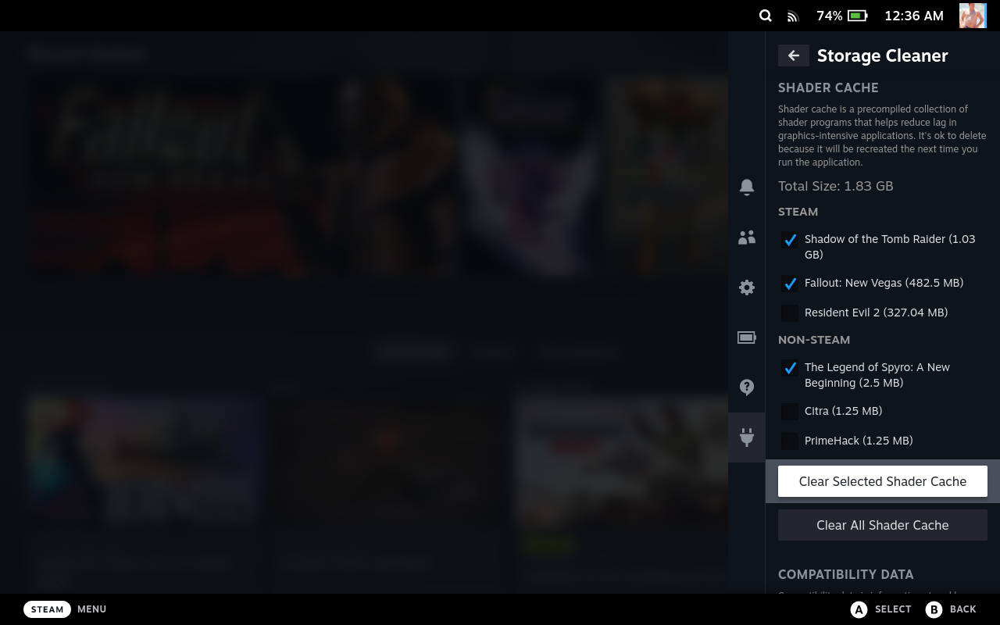
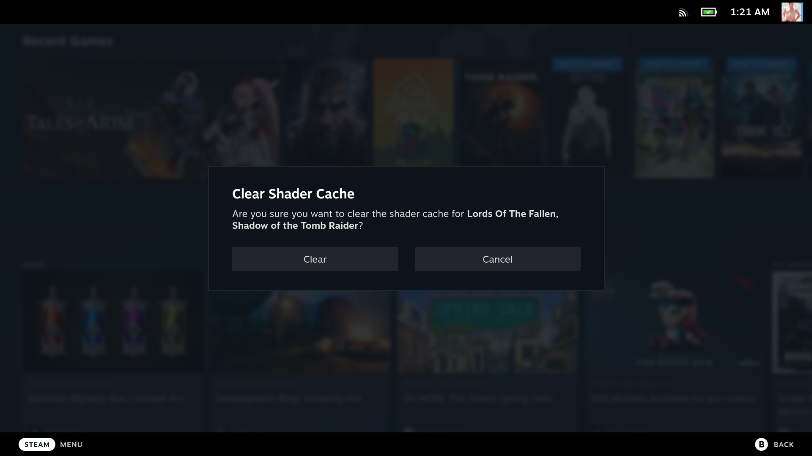

# Storage Cleaner

A [Decky Loader](https://github.com/SteamDeckHomebrew/decky-loader) plugin for tidying up your Steam Deck's storage (and getting rid of that pesky 'Other' storage eating it all up)!

## Features

- Get disk usage stats for your Steam Deck's shader cache and compatibility data
- Selectively clear the shader cache and compatibility data you don't want
- Clear all the shader cache or compatibility data all at once

## Installation

### Decky Loader Store

> Storage Cleaner is currently in Beta testing and may not be avaialble in the Decky store yet. If that is the case, try installing manually.

1. Install [Decky Loader](https://deckbrew.xyz/)
2. Open the Quick Access menu
3. Open the Plugins Browser
4. Find Storage Cleaner and press "Install"

### Manually

> WARNING: This plugin requires root access to your deck to clear temp data. Install at your own risk!

1. Assuming Decky Loader is already installed, click the Quick Access button and navigate to the Plug icon (Decky)
2. Click the Gear icon (settings)
3. Under the Decky tab, scroll down to the 'Other' section
4. Enter or copy and paste the following url into the input field: https://www.mcarlucci.com/decky-storage-cleaner.zip
5. Press the Install button above the input field
6. You will see a confirm modal with '!!!!NO HASH PROVIDED!!!!' in red, press the Install button (this is normal as the plugin is still in beta and not officially approved by the Decky Loader team yet). The plug-in should take around 10 seconds to install. If the confirm modal goes away pretty quickly, it is likely you entered a typo when typing in the url.  
7. Decky will reopen, but Storage Cleaner won’t show up in the list
8. Restart your Steam Deck
9. Storage Cleaner should now show up in Decky Loader

## Possible Future Features

- Support microsd storage...?
- Clear depotcache...?
- Small disk analyser/visualizer...?
- Auto/scheduled cache cleanups...?
